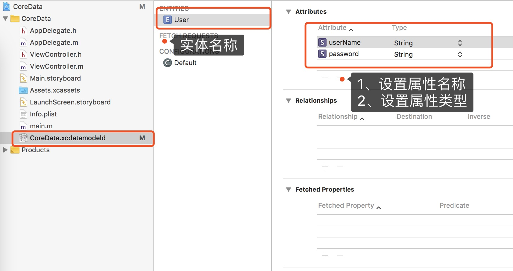
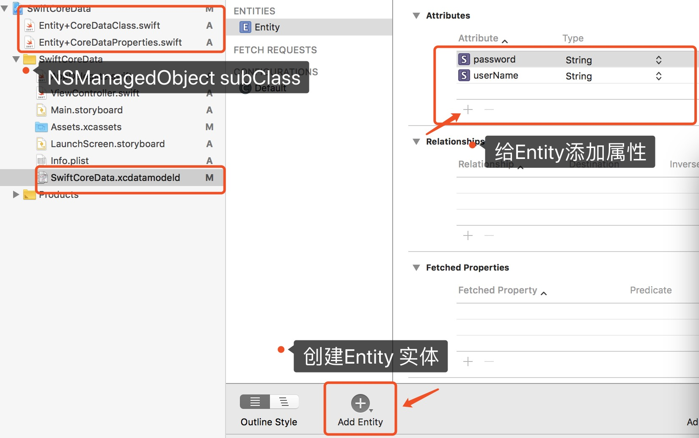

# 1. OC
### 使用 CoreData 进行数据的持久化

1、CoreData 是一个Cocoa框架，用于存储和管理应用程序中MVC设计模式中模型层数据。对象的持久化表示CoreData框架可以将模型对象保存到持久化文件中。

2、CoreData 框架中包含了FetchRequest数据查询请求、ManagedObjectContent托管对象上下文、PersistentStoreCoordinate持久化存储协调器和PersistentStore持久化存储等概念。

#### 基本概念

1. FetchRequest：数据查询请求
2. ManagedObjectContent：托管对象上下文
3. ManagedObject：托管对象
4. PersistentStoreCoordinate：持久化存储协调器
5. PersistentStore：持久化存储

CoreData 支持4种类型的持久化存储

<pre>
1. SQLiteStore
2. XMLStore
3. BinaryStore
4. InMemoryStore
</pre>

#### 代码操作

* 创建managedObjectcontext对象

<pre>
#pragma mark - lazy
- (NSManagedObjectContext *)managedObjectcontext{
    if (_managedObjectcontext == nil) {
        AppDelegate * appDelegate = (AppDelegate *)[UIApplication sharedApplication].delegate;
        _managedObjectcontext = appDelegate.persistentContainer.viewContext;
    }
    return _managedObjectcontext;
}
</pre>

* 创建fecthRequest对象

<pre>
/**
 request
 
         创建fecthRequest 获取请求;
     NSFetchRequest * fetchRequest = [NSFetchRequest fetchRequestWithEntityName:@"User"];
         用语数据查询的偏移位置;
     fetchRequest.fetchOffset = 0;
         查询的数据总量;
     fetchRequest.fetchLimit = 10;
         获取托管对象上下文的User实体;
     NSEntityDescription * entityDescription = [NSEntityDescription entityForName:@"User" inManagedObjectContext:self.managedObjectcontext];
         设置查询条件;
     fetchRequest.entity = entityDescription;

 @return request
 */
- (NSFetchRequest *)fetchRequest{
    if (_fetchRequest == nil) {
        _fetchRequest = [NSFetchRequest fetchRequestWithEntityName:@"User"];
        _fetchRequest.fetchOffset = 0;
        _fetchRequest.fetchLimit = 10;
        _fetchRequest.predicate = nil;
        _fetchRequest.entity = [NSEntityDescription entityForName:@"User" inManagedObjectContext:self.managedObjectcontext];
    }
    return _fetchRequest;
}
</pre>

* 增删改查

<pre>
#pragma mark - delete-update-save-inquire
- (void)deleteCurrentObject{
   
    NSError *error = nil;
    //    发起查询请求并返回查询结果;
    NSArray * result = [self.managedObjectcontext executeFetchRequest:self.fetchRequest error:&error];
    if (error) {
        NSLog(@"删除数据失败--%@",error);
    }else{
        NSLog(@"删除数据成功");
        for (User * user in result) {
            [self.managedObjectcontext deleteObject:user];
            [self.managedObjectcontext save:&error];
        }
        
    }
}
- (void)updateCurrentObject{
    //    设置查询条件;
    NSPredicate * predicate = [NSPredicate predicateWithFormat:@"userName = 'tongle'"];
    self.fetchRequest.predicate = predicate;
    NSError *error = nil;
    //    发起查询请求并返回查询结果;
    NSArray * result = [self.managedObjectcontext executeFetchRequest:self.fetchRequest error:&error];
    if (error) {
        NSLog(@"更新数据失败--%@",error);
    }else{
        NSLog(@"更新数据成功");
        for (User * user in result) {
            user.password = @"11111111";
            [self.managedObjectcontext save:&error];
            NSLog(@"%@",user.userName);
            NSLog(@"%@",user.password);
        }
    }
}

- (void)inquireCurrentObject{

    //    设置查询条件;
    NSPredicate * predicate = [NSPredicate predicateWithFormat:@"userName = 'tongle'"];
    self.fetchRequest.predicate = predicate;
    NSError *error = nil;
    //    发起查询请求并返回查询结果;
    NSArray * result = [self.managedObjectcontext executeFetchRequest:self.fetchRequest error:&error];
    if (error) {
        NSLog(@"获取数据失败--%@",error);
    }else{
        NSLog(@"获取数据成功");
        for (User * user in result) {
            NSLog(@"%@",user.userName);
            NSLog(@"%@",user.password);
        }
    }
}
- (void)saveCurrentObject{
   
    //    获取Entity对象;
    User * user = [NSEntityDescription insertNewObjectForEntityForName:@"User" inManagedObjectContext:self.managedObjectcontext];
    user.userName = @"tongle";
    user.password = @"123456";
    NSError *error = nil;
    //    保存;
    [self.managedObjectcontext save:&error];
    if (error) {
        NSLog(@"保存失败--%@",error.userInfo);
    } else{
        NSLog(@"保存成功");
    }
}
</pre>

# 2. Swift

<pre>
 func saveCoreData() -> Void {
        let appDelegate:AppDelegate = UIApplication.shared.delegate as!AppDelegate
        let managed = appDelegate.persistentContainer.viewContext
        let newUser = NSEntityDescription.insertNewObject(forEntityName: "Entity", into: managed)as!Entity
        newUser.userName = "tongle"
        newUser.password = "123456"
        
        do {
            try managed.save()
            print("保存成功")
        } catch  {
            print("保存失败")
        }
    }
    func deleteCoreData() -> Void {
        let appDelegate:AppDelegate = UIApplication.shared.delegate as!AppDelegate
        let managed = appDelegate.persistentContainer.viewContext
        let entity:NSEntityDescription =  NSEntityDescription.entity(forEntityName: "Entity", in: managed)!
        let request = NSFetchRequest<Entity>(entityName: "Entity")
        request.fetchOffset = 0
        request.fetchLimit = 10
        request.entity = entity;
        
        let predicate = NSPredicate(format: "userName = 'tongle'")
        request.predicate = predicate
        do {
            print("删除成功")
            let results:[AnyObject]? = try managed.fetch(request)
            for user:Entity in results as![Entity] {
                managed.delete(user)
            }
        } catch  {
            print("删除失败")
        }
    }
    func updateCoreData() -> Void {
        let appDelegate:AppDelegate = UIApplication.shared.delegate as!AppDelegate
        let managed = appDelegate.persistentContainer.viewContext
        let entity:NSEntityDescription =  NSEntityDescription.entity(forEntityName: "Entity", in: managed)!
        let request = NSFetchRequest<Entity>(entityName: "Entity")
        request.fetchOffset = 0
        request.fetchLimit = 10
        request.entity = entity;
        
        let predicate = NSPredicate(format: "userName = 'tongle'")
        request.predicate = predicate
        do {
            print("更新成功")
            let results:[AnyObject]? = try managed.fetch(request)
            for user:Entity in results as![Entity] {
                user.password = "1111111"
                try managed.save()
            }
        } catch  {
            print("更新失败")
        }
    }
    func inquireCoreData() -> Void {
        let appDelegate:AppDelegate = UIApplication.shared.delegate as!AppDelegate
        let managed = appDelegate.persistentContainer.viewContext
        let entity:NSEntityDescription =  NSEntityDescription.entity(forEntityName: "Entity", in: managed)!
        let request = NSFetchRequest<Entity>(entityName: "Entity")
        request.fetchOffset = 0
        request.fetchLimit = 10
        request.entity = entity;
        
        let predicate = NSPredicate(format: "userName = 'tongle'")
        request.predicate = predicate
        do {
            print("查询成功")
            let results:[AnyObject]? = try managed.fetch(request)
            for user:Entity in results as![Entity] {
                print("userName = \(String(describing: user.userName))")
                print("userName = \(String(describing: user.password))")
            }
        } catch  {
            print("查询失败")
        }
    }

</pre>